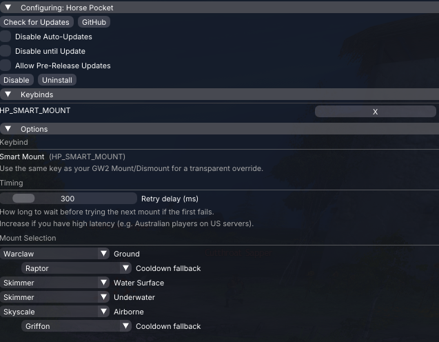

# Horse Pocket

A [Nexus](https://raidcore.gg/Nexus) addon for Guild Wars 2 that replaces your mount keybind with a smart one. Press it anywhere — it picks the right mount automatically.

## AI Notice

This addon has been largely created using Claude. I understand that some folks have a moral, financial or political objection to creating software using an LLM. I just wanted to make a useful tool for the GW2 community, and this was the only way I could do it.

If an LLM creating software upsets you, then perhaps this repo isn't for you. Move on, and enjoy your day.

## Screenshot

## Features

- **Terrain detection** — automatically selects Ground, Water Surface, Underwater, or Airborne mounts based on your position
- **Cooldown fallback** — if your preferred mount (Warclaw, Skyscale) is on cooldown, it tries a backup
- **Airborne fallback** — without RTAPI, detects being airborne by trying a ground mount first; if it fails, tries your flying mount
- **Configurable retry delay** — increase if you're on a high-latency connection

## Setup

1. Install via Nexus or drop `HorsePocket.dll` into your `<GW2>/addons/HorsePocket/` folder
2. In **Nexus Settings → Keybinds**, assign `HP_SMART_MOUNT` — use the same key as your GW2 Mount/Dismount keybind
3. Configure your preferred mounts per scenario in the Horse Pocket options panel

## Requirements

- [Nexus](https://raidcore.gg/Nexus)
- [RTAPI](https://github.com/TyrianDeveloperCollective/GW2-RealTime-API-Releases) *(optional — improves airborne detection)*

## Third-Party Credits

- [GW2Radial](https://github.com/RaidcoreGG/GW2-RadialMenus) — terrain detection approach (MumbleLink Y-axis thresholds)
- [nlohmann/json](https://github.com/nlohmann/json) — JSON config serialisation

## License

MIT — see [LICENSE](LICENSE)
